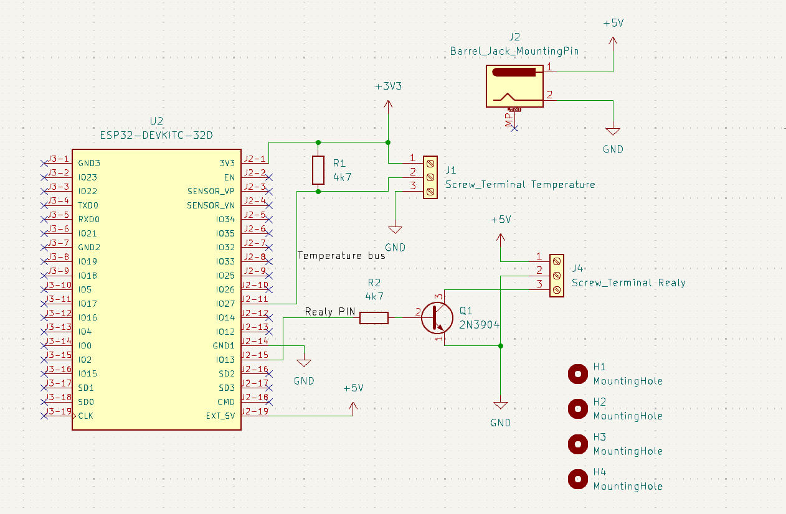
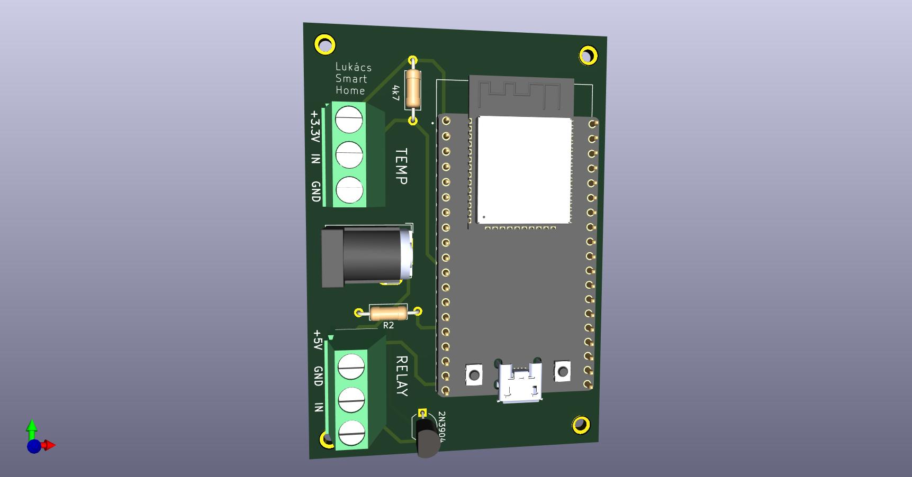
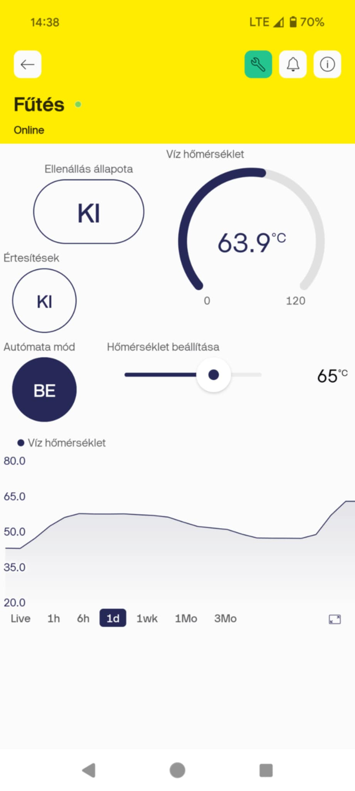

# SmartHome Relay 🌡️🔔

This project is a smart boiler control and monitoring system built on the **Blynk platform**. Using an **ESP32**, this system allows users to:  
- **Remotely control a relay** to activate or deactivate the built-in heating resistance of the boiler.  
- **Monitor the temperature** inside the boiler in real-time.  
- **Automate boiler heating** using thermostat-like behavior based on a set temperature range.  
- **Enable or disable notifications** for temperature changes or system events.

The project combines hardware design, embedded programming, and IoT integration for a seamless smart home experience.

---

## 📜 Table of Contents  

- [✨ Features](#features)  
- [🚀 Getting Started](#getting-started)  
  - [Hardware](#hardware)  
  - [Software](#software)  
- [⚙️ Hardware Design](#Hardware-Design)  
  - [Circuit Diagram](#circuit-diagram)  
  - [PCB 3D View](#pcb-3d-view)  
- [📲 Blynk App Interface](#blynk-app-interface)  
- [🛠️ Code Overview](#code-overview)  
  - [Dependencies](#dependencies)  
  - [Uploading the Code](#uploading-the-code)  
- [PCB Design](#pcb-design)  

## Features ✨

- **Remote Control**: Control the heating resistance via the Blynk mobile app.
- **Real-time Temperature Monitoring**: Display temperature data from the boiler directly in the app.
- **Automated Thermostat Mode**: Set a target temperature range, and the system will automatically control the relay.
- **Notification Toggle**: Enable or disable notifications for system status and alerts.
- **Custom PCB Design**: Compact and efficient PCB for the ESP32 and relay circuit, designed in KiCAD.
- **User-friendly Interface**: Intuitive and easy-to-use Blynk app interface for controlling and monitoring.

---

## Getting Started

### Hardware

- **Microcontroller**: ESP32
- **Temperature Sensor**: DS18B20  
- **Relay Module**: Controls the heating resistance
- **Custom PCB**: Designed to integrate the ESP32, relay, and sensor connections  

### Software

- **Arduino IDE**: Development environment for the ESP32 firmware  
- **Blynk**: Cloud-based platform for IoT app creation  
- **KiCAD**: Used for designing the PCB  

---

## Hardware Design📐

### Circuit Diagram

### PCB 3D View

---

## Blynk App Interface 📱

The Blynk app provides an intuitive interface for interacting with the SmartHome Relay system:

### Features:
- **Relay Control**: Toggle the relay to activate or deactivate the heating resistance.  
- **Temperature Display**: Real-time temperature monitoring from the boiler.  
- **Automation Mode**: Set a target temperature range for thermostat-like operation.  
- **Notifications Toggle**: Enable or disable notifications for system status and alerts.

---

## Code Overview

### Dependencies

Ensure the following libraries are installed in Arduino IDE:
1. **Blynk**  
2. **ESP32 Board Support**  
3. **Temperature Sensor Library**

### Uploading the Code

1. Clone the repository.
2. Open the `.ino` file in Arduino IDE.
3. Configure your WiFi and Blynk credentials in the code.
4. Upload the code to the ESP32 using a USB connection.

---

## PCB Design

- The PCB design was created using **KiCAD**.
- It includes the ESP32, relay, and connectors for the temperature sensor.
- You can [link PCB ordering instructions here] if relevant.
